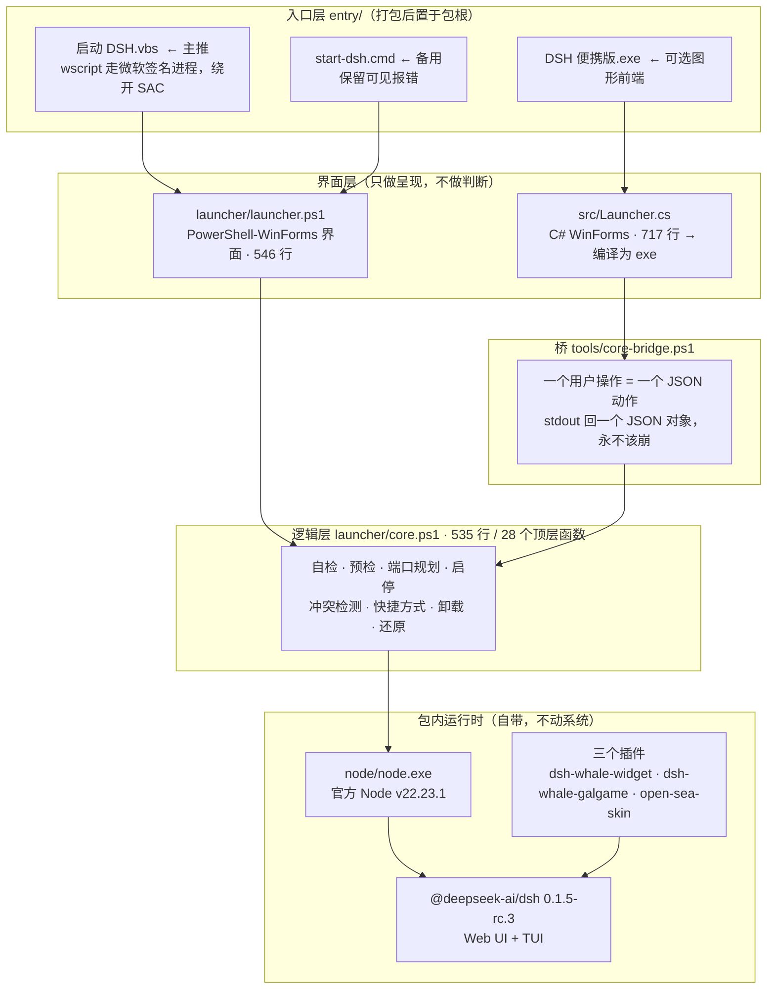
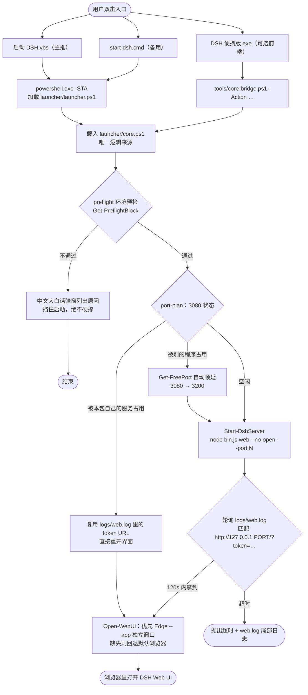
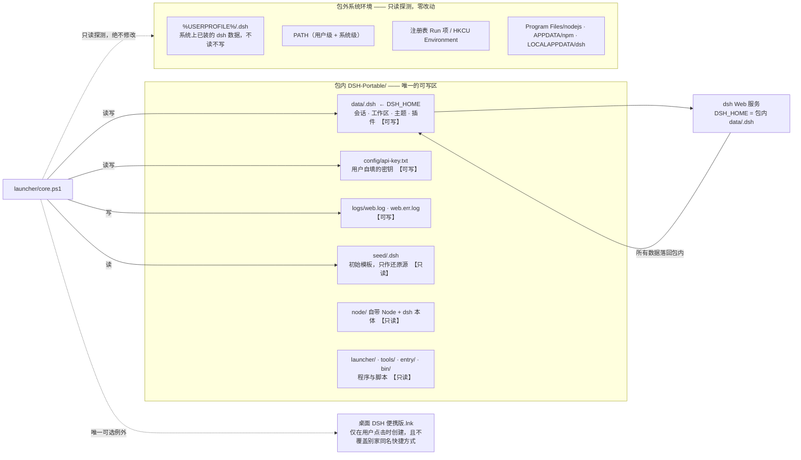
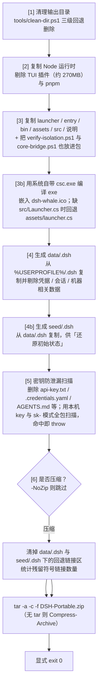
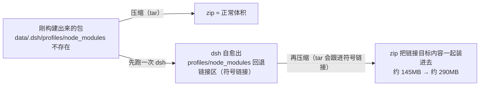

# DSH 便携版 · 架构文档

> 本文档描述 **[DeepSeekHarness-Portable](https://github.com/Yata-Datacom/DeepSeekHarness-Portable)**（「DSH 便携版」）的架构。
> 所有事实均取自仓库当前源码，文中出现的每个路径都在仓库里真实存在。

---

## 1. 这是什么

把 **DeepSeek Harness**（官方 npm 包 `@deepseek-ai/dsh`，带 Web UI 与 TUI）连同**官方 Node 运行时**一起打包成一个 Windows 便携文件夹：**解压 → 双击 → 就能用**，不需要装任何东西，面向不碰命令行的使用者。

| 维度 | 事实 |
| :-- | :-- |
| 运行要求 | **64 位** Windows 10 **1809（Build 17763）** 及以上 |
| Node 运行时 | **包内自带官方 Node v22.23.1**，不依赖系统 Node，不读系统 PATH 里的 node |
| 包内最长相对路径 | **197 字符**（所以不要解压到很深的目录，否则可能撞 260 上限） |
| 默认端口 | **3080**（被占用时自动顺延到其它空闲端口；`verify-isolation.ps1` 默认改用 3099，避免与本机服务相撞） |
| 数据位置 | 全部在包内 `data\.dsh`（即 `DSH_HOME`） |
| 系统改动 | 不写注册表、不改 PATH、不动系统目录、不读写 `%USERPROFILE%\.dsh` |

**核心设计原则一句话**：*判断逻辑只有一份*（`launcher/core.ps1`），界面层只负责呈现；*包外环境零改动*，且这一点由包内自带脚本可复现地自证。

---

## 2. 目录职责表

以下路径全部位于**仓库根**，与打包产物的目录结构基本一一对应。

| 路径 | 层 | 职责 |
| :-- | :-- | :-- |
| `entry/启动 DSH.vbs` | 入口层 | **主推入口**。双击即走微软签名的 `wscript.exe` → `powershell.exe`，因此**不会被 Smart App Control 拦截**；无黑框闪现，调 `launcher\launcher.ps1` |
| `entry/start-dsh.cmd` | 入口层 | 备用控制台入口，同样调 `launcher\launcher.ps1`，保留可见报错；纯 ASCII 以避免代码页问题 |
| `src/Launcher.cs` | 界面层（C#） | C# WinForms 图形界面源码（717 行 / 约 30 KB）。用 Windows 自带 `csc.exe` 编译成约 126 KB 的 `DSH 便携版.exe`，**无 .NET SDK 依赖**。界面只做呈现，逻辑全部走桥 |
| `launcher/launcher.ps1` | 界面层（PowerShell） | 旧版纯 PowerShell-WinForms 界面层（546 行），已不再是主推界面，但仍被两个入口文件调用 |
| `launcher/core.ps1` | 逻辑层 | **全部判断逻辑**（535 行、28 个顶层函数）：环境自检、启动预检、端口规划、启停服务、冲突检测、快捷方式、干净卸载、模板还原。**函数返回数据对象，基本不改系统** |
| `tools/core-bridge.ps1` | 桥 | C# 界面与 `core.ps1` 之间的桥：**每个用户可见操作 = 一个 JSON 动作**，向 stdout 输出单个 JSON 对象；**密钥通过 stdin 传入而不是命令行** |
| `tools/verify-isolation.ps1` | 验证 | 环境隔离验证：快照 → 反复启停（自检 + CLI + Web 服务）→ 再快照 → 逐项对比，**断言包外零改动** |
| `tools/verify-package.ps1` | 验证 | **38 项产物完整性闸门**（结构 / 运行时 / 插件 / seed / 隐私 / 零符号链接 / 无密钥） |
| `tools/check-upstream.ps1` | 验证 | 比对 npm 上游版本与 `deps.json` 的锁定值，**有漂移即退出码 1** |
| `tools/assert-ascii.ps1` | 守卫 | 仓库内 `.ps1`/`.psm1` 必须**纯 ASCII 或带 UTF-8 BOM** |
| `tools/ci-prepare.ps1` | 构建 | CI 专用：铺 `ci-profile` 配置 → `pnpm install --frozen-lockfile` → 建 staging 目录（junction） |
| `tools/clean-dir.ps1` | 构建 | 长路径 / 符号链接目录的三级回退删除（原生长路径 → `git rm` → `robocopy /MIR` 空目录） |
| `tools/make_icon.py` | 构建 | 从鲸鱼娘立绘生成多尺寸 `.ico`（256/128/64/48/32/24/16） |
| `assets/dsh-whale.ico` | 资源 | 应用图标，构建时嵌入 exe |
| `assets/launcher.cs` | 资源 | 旧的 stub 回退源码：只负责调起 PowerShell 启动器，保证「缺 `src/Launcher.cs` 时构建不失败」 |
| `bin/dsh.cmd` | 包内 CLI | 包内启动 dsh 的封装：设置 `DSH_HOME` 指向包内 `data\.dsh`，把 `config\api-key.txt` 读进 `DEEPSEEK_API_KEY` |
| `build-package.ps1` | 构建 | 本机离线也能跑的打包器（275 行）：组装 staging → 嵌入图标 → 编译 exe → 内联 38 项校验 → 压缩 → SHA256 |
| `deps.json` | 依赖契约 | 构建清单：node 版本 + `@deepseek-ai/dsh` 精确版本 + 三个插件精确版本 |
| `ci-profile/` | 依赖契约 | 锁定的 profile 配置（`settings.yaml`、`web/package.json`、`web/cordis.yml`、`web/cordis.patch.yml`、`web/pnpm-workspace.yaml`）+ **锁文件 `web/pnpm-lock.yaml`** |
| `tests/` | 测试 | Pester 单测（`core.Tests.ps1`）+ 负向测试（`preflight.Tests.ps1`） |
| `.github/workflows/` | CI | `build.yml`（构建发版）、`upstream-watch.yml`（上游漂移监控） |

> 打包产物（`DSH-Portable\`、`*.zip`）**不入库**：源码在仓库，成品在 Releases。

---

## 3. 分层架构图

**为什么逻辑只有一份**：`src/Launcher.cs` 的注释写得很直白 —— *"Only the presentation lives here: every decision … is still made by `launcher\core.ps1`, reached through `tools\core-bridge.ps1` as JSON. That keeps one source of truth."*
所以两个界面层（PowerShell 版与 C# 版）拿到的是**同一套判断结果**，不存在两套实现漂移的问题。

---

## 4. 启动流程（从双击到浏览器打开）

**preflight 的四类拦截项**（`Get-PreflightBlock`，文案本身就是给使用者看的）：

1. 系统版本过旧（Build < 17763）——自带 Node 22 不支持 Win7/8/8.1 与早期 Win10
2. 系统是 32 位——包里是 64 位 Node，跑不起来
3. 缺 `node\node.exe`、`node.exe` 跑不动（32 位系统 / 被杀软隔离 / 解压不完整）、缺 dsh 本体
4. 包目录不可写（例如解压到了 `C:\Program Files` 这类受保护目录）

**启动流程里的两个关键设计**：

- **端口自动避让**：3080 只读探测，绝不抢占别人的端口；如果占用者**恰好是本包的 `node.exe`**，则判定为「服务已在运行」，直接复用日志里的 token URL 重开界面，而不是再起一个。
- **就绪判定靠日志而不是端口**：dsh 起服务时打印带 token 的 URL，`Get-DshUrlFromLog` 用正则从 `logs/web.log` 里抓这条 URL；端口被监听但 URL 还没出现时会再等一会，超时则抛出并附上日志尾部。

---

## 5. 桥协议：`tools/core-bridge.ps1`

界面层与逻辑层之间**没有共享内存，也没有 PowerShell 函数直调**，只有一个瘦协议：

| 特性 | 实现 |
| :-- | :-- |
| 调用形式 | `powershell.exe -NoProfile -ExecutionPolicy Bypass -File tools\core-bridge.ps1 -Action <动作> [-Port N] [-Keys a,b] [-Url …]` |
| 输出 | stdout **恰好一个 JSON 对象**，然后 `exit 0` |
| 预期内失败 | 返回 `{"ok":false,"error":"…"}`，**而不是抛栈** —— 界面显示一句人话，不是一片红色 |
| **密钥** | `-Action set-key` 时**密钥从 stdin 读**（`[Console]::In.ReadToEnd()`），**绝不出现在命令行**——命令行对同机所有进程可见 |
| 编码 | 强制 `[Console]::OutputEncoding = UTF8（无 BOM）`，否则 PS 5.1 会按 GBK 输出，C# 端读到乱码 |
| 动作集 | `version` `envcheck` `preflight` `conflicts` `port-plan` `uninstall-items` `shortcut-state` `shortcut-create` `shortcut-delete` `shortcut-asked-set` `key-state` `set-key` `url` `start` `stop` `uninstall` `restore` `force-reset` `data-dir` `open-web` |

C# 端用 `JavaScriptSerializer` 反序列化（只依赖 `System.Web.Extensions.dll`，属 .NET Framework 自带），并把**阻塞动作（如 `start`）放到后台线程**执行，窗口保持响应。

---

## 6. 环境隔离边界

这是整个项目的卖点，也是 CI 里唯一一条**真的把包跑起来**的测试所验证的东西。

**具体约束**：

- 进程环境变量只作用于子进程：`Get-DshEnv` 设置 `DEEPSEEK_API_KEY`、`DSH_HOME`、`NO_COLOR`，**不写用户级/系统级环境变量**。
- `bin/dsh.cmd` 同样把 `DSH_HOME` 重定向到包内，所以 CLI 也不会碰系统 `~/.dsh`。
- 注册表只**读**（系统版本 `HKLM:\SOFTWARE\Microsoft\Windows NT\CurrentVersion`、Smart App Control 策略 `HKLM:\SYSTEM\CurrentControlSet\Control\CI\Policy`），从不写。
- 桌面快捷方式**绝不静默创建**：只有在用户明确点按钮时创建；发现桌面已有同名但指向别处的快捷方式时**报错退出、不改动**。
- 干净卸载只清理本包自己的东西，并且逐项区分「是本包建的」和「不是本包建的」。
- 唯一被 `verify-isolation.ps1` 列为「已知且可解释」的包外改动，就是桌面那个 `.lnk`。

**自动化证明**：`tools/verify-isolation.ps1` 给系统拍快照（`~/.dsh` 全量清单、用户级+系统级环境变量、PATH、注册表 Run/Environment、桌面与文档顶层清单、常见 node/npm/dsh 安装位）→ 反复启停若干轮 → 再拍快照 → 逐项 diff。CI 每次构建都跑（`-Rounds 2 -Port 3099`），**任何一处包外改动即退出码 1**。

---

## 7. 依赖锁定与可复现

| 文件 | 角色 |
| :-- | :-- |
| `deps.json` | **人类可读的构建清单**：`node: 22.23.1`、`pnpm: 10`、`@deepseek-ai/dsh: 0.1.5-rc.3`、插件 `dsh-whale-galgame 0.4.1`（npm）、`dsh-whale-widget 0.3.11`（git：`MeteorNOX/DeepSeek-Balance-Whale-Widget`，锁到 commit `5465454…`）、`open-sea-skin 1.2.3`（npm）；并记录运行时要求 `Windows 10 1809 (17763) or later / x64` |
| `ci-profile/web/pnpm-lock.yaml` | **机器真相**：记录每个依赖的完整性哈希；git 依赖连 commit 一起锁 —— 所以 `pnpm install --frozen-lockfile` 不需要 `git ls-remote` |
| `ci-profile/web/package.json` | profile 的依赖声明 + `dsh.profile.bundles` 里显式列出要组合的 bundle 与三个插件 |
| `ci-profile/settings.yaml` | 便携包的默认设置（UI onboarding 版本、默认模型 `deepseek-flash` / `reasoningEffort: low`） |

重建环境的标准动作就是 `pnpm install --frozen-lockfile`（`tools/ci-prepare.ps1` 里执行的那一条）。**依赖漂移是有意为之的决策点**，不是惊喜。

---

## 8. 构建流水线（`build-package.ps1`）

### 为什么「压缩必须排在真正运行包之前」

这是本项目里**最重要的一条顺序约束**，在 `build-package.ps1`、`build.yml` 与 `README` 里被三处独立呼应：

三层防护：

1. **构建脚本内**：压缩前主动删除 `data\.dsh\profiles\node_modules` 与 `seed\.dsh\profiles\node_modules` 下的 reparse point，再统计包内残留符号链接数量，非 0 就警告。
2. **CI 顺序**：`Zip + SHA256` 步骤**排在** `End-to-end isolation test` 之前 —— 端到端测试会真的启动/停止服务，运行时序不能再压缩。
3. **38 项闸门**：`verify-package.ps1` 有一项专门断言 **0 个 reparse point**。

> 附带一条同样重要的约束：`profiles\node_modules` 之所以在复制 `data\.dsh` 时被**有意排除**，是因为那是 dsh 的「安装回退」链接区，实体化会让 dsh 报 `exists and is not a symlink` 而拒绝启动；缺失时 dsh 会自己重建（`healProfilesModuleFallback`），无需随包分发。

---

## 9. CI：两个作业的职责

### `.github/workflows/build.yml` — `test` → `portable`

| 作业 | 触发/依赖 | 职责 |
| :-- | :-- | :-- |
| **`test`** | 无依赖，先跑，`timeout: 15min` | ① 装 Pester 5；② 跑 `tools/assert-ascii.ps1`（**ASCII 守卫**，3 min）；③ 跑 `./tests` 单测 + 负向测试（8 min），**有失败即 throw** |
| **`portable`** | **`needs: test`**，`timeout: 45min` | 构建 → 闸门 → 压缩 → E2E 隔离测试 → 草稿 Release |

`portable` 的步骤序列：

| # | 步骤 | 说明 |
| :-- | :-- | :-- |
| 1 | 读 `deps.json` | 取 `node` / `dsh` / `pnpm` 版本，写进 `$GITHUB_OUTPUT` |
| 2 | `actions/setup-node` | 用清单里的 node 版本 |
| 3 | 把 dsh 装进 Node 目录 | 通过 `NPM_CONFIG_PREFIX`（环境变量胜过 `.npmrc`）让 npm 前缀 = node 目录，**与本地打包布局完全一致**；探测失败则退回「装到临时目录再 graft 进 `node\node_modules`，并把 `.bin` 里的 `dsh` shim 复制到 node 目录」 |
| 4 | `tools/ci-prepare.ps1` | 铺 `~/.dsh`（来自 `ci-profile/`）→ 装 pnpm → `pnpm install --frozen-lockfile` → 建 staging：`staging\node` 与 `staging\pack` 两个 junction |
| 5 | 断言 3 个插件已 composed | `dsh --profile web --dump-config` 里必须同时出现三个插件名，**防「装了但没生效」的静默失效** |
| 6 | `build-package.ps1 -Src ./staging -Out ./out -NoZip` | 产出 `out\DSH-Portable\` |
| 7 | `tools/verify-package.ps1` | **38 项完整性闸门** |
| 8 | `Zip + SHA256` | `tar -a -c -f` 打包 + 生成 `SHA256SUMS.txt` |
| 9 | `upload-artifact` | 上传 zip 与校验和，**保留 14 天** |
| 10 | **端到端隔离测试** | 在**干净机器**上真正启动/停止 Web 服务（`-Rounds 2 -Port 3099`），脚本自带假 `sk-` 密钥（不需要任何 secret），**包外有任何变化即退出码 1** |
| 11 | **草稿 Release** | 仅在 tag 推送时执行，且**幂等**：tag 已存在就 `gh release edit --draft` + `--clobber` 重传；不存在就 `gh release create --draft`。**永远只建草稿，人工 publish** |

触发方式：`workflow_dispatch`（可带 `publish` 输入）或推送 `v*` tag。**顺序上刻意把「压缩」放在「端到端运行」之前**（见第 8 节）。

`tests/` 覆盖什么：
- `core.Tests.ps1` —— 把 `core.ps1` 的路径变量整体重定向到一个临时 scratch 包根，专门测「**只返回数据、什么都不动**」的那一半：密钥校验（长度 / `sk-` 前缀 / 原样读回）、端口助手（空闲 / 占用 / 顺延 / 全占满抛错）、token URL 解析、卸载项清单、冲突检测（干净包里**不得**出现硬冲突，外来监听者必须被标为冲突）、`Test-Seed`、`Get-EnvCheck` 的结构与状态取值。
- `preflight.Tests.ps1` —— 专打**失败路径**：缺 `node.exe`、缺 dsh 本体、64 位宿主上不得误报 32 位问题、不可写目录要「报错而不是抛异常」，以及「检查过程不得在宿主上留下任何东西」。

### `.github/workflows/upstream-watch.yml` — 上游漂移监控

| 项 | 值 |
| :-- | :-- |
| 触发 | `schedule`：`17 3 * * 1`（每周一 03:17 UTC）+ `workflow_dispatch` |
| 权限 | `contents: read` + `issues: write` |
| 动作 | 单个步骤调 `tools/check-upstream.ps1`（跑在子进程里，所以它退出码非 0 不会杀掉 workflow shell），把表格原样打到日志 |
| 漂移时 | 退出码 1 → 搜 `--state open --search "… in:title"`：已有同名 issue 就**评论**，没有就**新建**，正文包含表格与「如何 bump」的说明（改 `deps.json` → 在 `ci-profile/web` 里 `pnpm install` 让锁文件记下新版本 → push 让构建证明闸门仍然全绿） |
| 无漂移 | 退出码 0，不做任何事 |

| 被监控的锁定项 | 比对来源 |
| :-- | :-- |
| `node` | 不自动比对（脚本里标注 `manual`，由人查 nodejs.org） |
| `@deepseek-ai/dsh` | npm registry `/latest` |
| `dsh-whale-galgame` / `open-sea-skin` | npm registry `/latest` |
| `dsh-whale-widget` | 它是 git 托管，这里比对的是 **npm 镜像**上的版本，备注里注明真实来源是 git |

---

## 10. 编码约束：为什么脚本必须是纯 ASCII 或带 BOM

这不是风格洁癖，而是一个**视觉上看不出来的 bug 类**：Windows PowerShell 5.1 把**没有 BOM** 的 `.ps1` 当 ANSI 读，于是中文**字面量**参与功能性判断（比如 `Get-ChildItem -Filter` 模式）时会**静默匹配不到任何东西**，而周围的输出看起来一切正常。

因此仓库里有明确的双轨规则，并由 CI 强制：

- `tools/assert-ascii.ps1` 扫描所有 `.ps1` / `.psm1`（排除 `node_modules`、`.git`、`out`、`staging`）：有非 ASCII 字节**且**没有 UTF-8 BOM → **失败并退出码 1**。
- 结果就是：`core-bridge.ps1`、`verify-package.ps1`、`ci-prepare.ps1`、`check-upstream.ps1`、两个测试文件等**保持纯 ASCII**，需要中文的地方用**码点构造**（例如测试里用 `[char]0x5BC6 + [char]0x94A5` 拼出「密钥」）；而面向使用者的中文文案则集中在 `launcher/core.ps1`、`launcher/launcher.ps1`、`src/Launcher.cs` 等文件里。
- 与之配套的是输出编码：`core-bridge.ps1` 显式把 stdout 切成无 BOM UTF-8，C# 端也用 `Encoding.UTF8` 读，否则中文在 C# 侧会变乱码。

另外两条 C# 侧的硬约束：**exe 用系统自带 `csc.exe` 编译**（`/target:winexe` + `/win32icon:` + `/r:System.Web.Extensions.dll`），因此**只能用 C# 5 语法**、无 .NET SDK 依赖；新编译出来的二进制**签名后才不会被 Smart App Control 拦**，这也是保留 `启动 DSH.vbs` 这条「走微软签名进程」入口的根本原因。

---

## 11. 已知取舍与注意事项

| 项 | 现状 / 原因 |
| :-- | :-- |
| 双重界面层 | `launcher/launcher.ps1`（PowerShell-WinForms）与 `src/Launcher.cs`（C#）并存。两者都只做呈现，逻辑共用 `core.ps1`；C# 版是产物里的 `DSH 便携版.exe`，PowerShell 版是入口文件实际调用的那一个 |
| exe 可能缺失 | 找不到 `csc.exe` 或编译失败时，构建**不会失败**，只打印提示 —— 此时改用 `启动 DSH.vbs` 或 `start-dsh.cmd`，功能不受影响 |
| `assets/launcher.cs` 的存在 | 纯粹是构建健壮性回退（stub 只负责调起 PowerShell 启动器），保证缺 `src/Launcher.cs` 时打包永不失败 |
| 路径长度 | 包内最长相对路径 197 字符，解压位置要短 |
| 不能先跑再压 | 跑过一次 dsh 就会在包内自愈出符号链接，压缩会跟进导致体积翻倍（见第 8 节） |
| 端口 | 默认 3080，被占用自动顺延；隔离验证脚本用 3099 以免与本机服务混淆 |
| 密钥 | 包内**绝不含** API key；`DEEPSEEK_API_KEY` 只来自用户自填的 `config\api-key.txt` 或环境变量；构建脚本内置泄漏扫描，命中即中止打包 |
| 镜像内的真实代码 | 便携包里的 `data\.dsh` 与 `seed\.dsh` 由打包器从本机 `%USERPROFILE%\.dsh` 白名单式复制而来（剔除凭据、会话、`AGENTS.md` 私人人设等），CI 路径则改为从 `ci-profile/` 生成 |

---

## 12. 参考

- 使用者文档：`README-使用说明.md`（仓库根，同时被复制进包内）、`使用说明.txt`
- 仓库说明与发布流程：`README.md` / `README.en.md`
- 第三方组件与许可：`NOTICE.md`、`LICENSE`
- 自助验证：`tools/verify-isolation.ps1`（隔离）、`tools/verify-package.ps1`（完整性）、`tools/check-upstream.ps1`（上游漂移）
